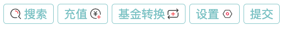
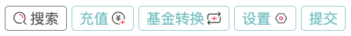
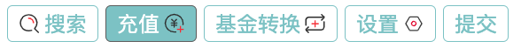

# 轮子 - 一个Vue UI组件
[](https://app.travis-ci.com/hlr423/gulu)
--







 
## 介绍
   这是一个在学习Vue的过程中做的一个UI框架，希望对你有用。
   
## 开始使用

1.添加css样式
    使用框架前，请在css中开启border-box

```css
*,*::before,*::after{ box-sizing: border-box;}
```
IE 8 及以上浏览器都支持此样式

你还需要设置默认颜色等变量（后续会改为 scss变量）
```css
  html {
    /*纯色,渐变*/
    --button-height:32px;
    --font-size:1em;
    --button-bg:white;
    --button-bg-s-success:#19be6b;
    --button-bg-s-info:#6772FF;
    --button-bg-s-warning:#f5720d;
    --button-bg-s-error:#F87176;
    --border-color: #666;
    --color:#e30076;
    --color-hover:#666;
    --border-color: #666;
    --border-color-hover:#e30076;

    --button-bg-success:linear-gradient(to right, #39AC4C,#22BFE4);
    --button-bg-info:linear-gradient(to right, #6772FF 0,#00F9E5);
    --button-bg-warning:linear-gradient(to right, #f5720d, #CDDC30);
    --button-bg-error:linear-gradient(to right, #D40E00,#F87176);
    --border-image:linear-gradient(to right, #20e5f5, #7bb2f1) 1;
    --button-active-bg: #e30076;
    --border-radius:6px;
    --color-two:#fff;
    --color-hover-two:#fff;
    --border-color-two: #fff;
    --border-color-hover-two:#ddd;
  }
```
  IE 15 及以上浏览器都支持此样式


2.安装 hg-view
```
npm i --save hg-view
```

3.引入 hg-view
```
import {hButton} from "hg-view"
import "hg-view/dist/index.css"
components:{
  "h-button":hButton
}
```

4.引入 svg symbols (可自定义)
```
  <script type="module" src="//at.alicdn.com/t/c/font_3866991_h3mwe0iest.js"></script>
```
## 文档
目前支持 button,input,icon,video,row,col栅格布局 组件
## 提问
## 变更记录
## 联系方式
## 共享代码


#### 作者：wo

